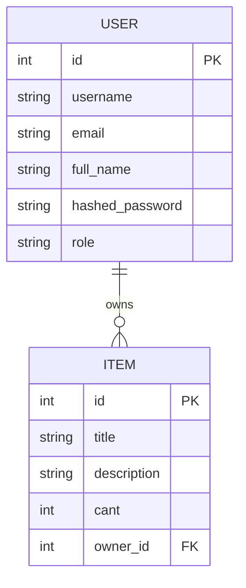

# FastAPI Technical Challenge

REST API desarrollada con FastAPI que implementa autenticación JWT, roles de usuario, CRUD de usuarios e items, frontend básico con HTML/CSS/JS y soporte para Docker.

---

# Features

- JWT Authentication
- Roles de usuario (`admin` / `user`)
- CRUD de usuarios
- CRUD de items
- Protección de endpoints
- Validación de ownership
- Frontend básico con HTML/CSS/JS
- Swagger Documentation (`/docs`)
- Docker support
- SQLite database
- Alembic migrations
- Tests con Pytest

---

# Tecnologías utilizadas

- FastAPI
- SQLModel
- SQLite
- Alembic
- JWT Authentication
- Pytest
- Docker

---

# Funcionalidades implementadas

## Usuarios

- Registro de usuarios
- Validación de username/email duplicados
- Login con JWT
- Roles:
  - Admin
  - User
- Eliminación protegida de usuarios
- Un admin no puede eliminarse a sí mismo

---

## Items

- Creación de items asociados al usuario autenticado
- Si un item ya existe:
  - se incrementa automáticamente la cantidad
- Eliminación protegida por ownership
- Paginación con `offset` y `limit`

---

# Autenticación

La aplicación utiliza JWT Bearer Tokens.

El token incluye:
- username
- role

La autenticación y autorización se implementan en `security.py`.

---

# Roles

## USER

Puede:
- ver usuarios
- crear items
- eliminar únicamente sus propios items

---

## ADMIN

Puede:
- eliminar usuarios
- acceder a controles administrativos
- administrar usuarios desde el dashboard

---

# Usuarios de prueba

## Admin

```txt
username: admin
password: admin
```

---

## Usuario normal

```txt
username: user
password: user
```

---

# Database Diagram



---

# Estructura del proyecto

```txt
Fast-API_test/
│
├── alembic/
├── routers/
│   ├── auth.py
│   ├── users.py
│   └── items.py
│
├── static/
├── templates/
├── test/
│
├── main.py
├── models.py
├── schemas.py
├── security.py
├── services.py
├── db.py
│
├── Dockerfile
├── docker-compose.yml
├── pyproject.toml
└── README.md
```

---

# Cómo ejecutar el proyecto

## 1. Clonar repositorio

```bash
git clone https://github.com/Mat-Indaco/fast-API.git
```

```bash
cd fast-API
```

---

# Ejecutar localmente

## Instalar dependencias

Con uv:

```bash
uv sync
```

o con pip:

```bash
pip install -r requirements.txt
```

---

## Ejecutar aplicación

```bash
uvicorn main:app --reload
```

---

# Swagger Docs

Disponible en:

```txt
http://127.0.0.1:8000/docs
```

---

# Frontend

Login:

```txt
http://127.0.0.1:8000/
```

Home:

```txt
http://127.0.0.1:8000/home
```

---

# Docker

## Build

```bash
docker build -t fastapi-app .
```

---

## Run

```bash
docker run -p 8000:8000 fastapi-app
```

---

# Docker Compose

```bash
docker compose up --build
```

---

# Tests

Ejecutar tests:

```bash
pytest
```

---

# Endpoints principales

## Auth

| Método | Endpoint | Descripción |
|---|---|---|
| POST | `/login` | Login JWT |

---

## Users

| Método | Endpoint | Descripción |
|---|---|---|
| POST | `/users/` | Crear usuario |
| GET | `/users/` | Listar usuarios |
| GET | `/users/{id}` | Obtener usuario |
| PATCH | `/users/{id}` | Actualizar usuario |
| DELETE | `/users/{id}` | Eliminar usuario |

---

## Items

| Método | Endpoint | Descripción |
|---|---|---|
| POST | `/items/` | Crear item |
| GET | `/items/` | Listar items |
| DELETE | `/items/{id}` | Eliminar item |

---

# Lógica de negocio implementada

- Roles de usuario
- Protección de endpoints
- Validación JWT
- Ownership de items
- Prevención de autodelete de admins
- Validación de usuarios duplicados
- Suma automática de cantidad de items repetidos

---

# Autor

Matías Indaco