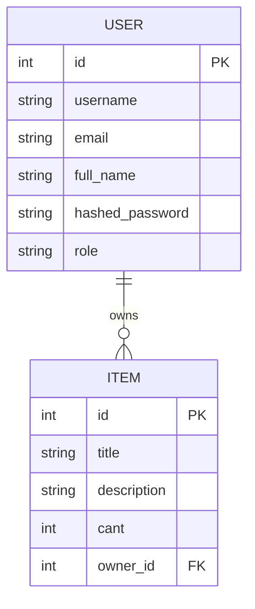

## Database Diagram

```mermaid
erDiagram

    USER {
        int id PK
        string username
        string email
        string full_name
        string hashed_password
        string role
    }

    ITEM {
        int id PK
        string title
        string description
        int cant
        int owner_id FK
    }

    USER ||--o{ ITEM : owns
```