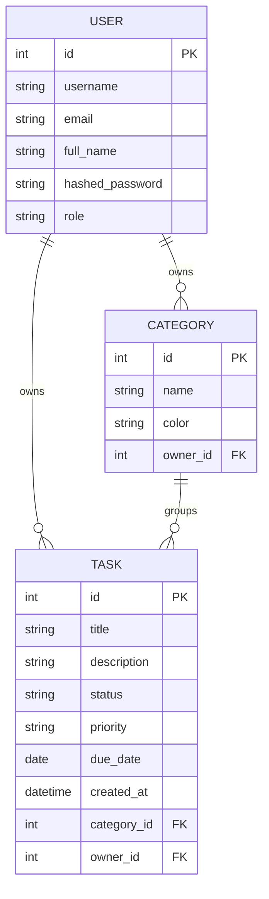

# Task Manager API

REST API de gestión de tareas desarrollada con FastAPI. Implementa autenticación JWT con refresh tokens, roles de usuario, CRUD completo de tareas con filtros y ordenamiento, categorías, estadísticas, notificaciones en tiempo real vía WebSocket, rate limiting, logging estructurado, migraciones con Alembic y soporte Docker.

---

## Tecnologías

- **FastAPI** — framework web async
- **SQLModel** — ORM + validación con Pydantic
- **SQLite** — base de datos
- **Alembic** — migraciones
- **JWT** — autenticación (access + refresh tokens)
- **WebSockets** — notificaciones en tiempo real
- **slowapi** — rate limiting
- **pydantic-settings** — configuración por entorno
- **Docker / Docker Compose** — contenedores
- **Pytest** — tests

---

## Cómo levantar el proyecto

### Con Docker (recomendado)

```bash
# 1. Clonar el repositorio
git clone https://github.com/Mat-Indaco/fast-API.git
cd fast-API

# 2. Crear el archivo de base de datos vacío (necesario para el volumen de Docker)
touch database.db

# 3. Levantar el proyecto
docker compose up --build
```

Al iniciar, Docker automáticamente:
- corre las migraciones de Alembic
- crea los usuarios, categorías y tareas de prueba
- levanta el servidor en el puerto 8000

La API queda disponible en: `http://localhost:8000`

---

### Localmente (sin Docker)

Requisitos: Python 3.13 y `uv` instalados.

```bash
# 1. Instalar dependencias
uv sync

# 2. Correr migraciones
uv run alembic upgrade head

# 3. Crear datos de prueba
uv run python seed.py

# 4. Levantar el servidor
uv run uvicorn main:app --reload
```

La API queda disponible en: `http://localhost:8000`

---

### Variables de entorno

El proyecto usa **pydantic-settings** para la configuración. Podés crear un archivo `.env` en la raíz para sobrescribir los defaults:

```env
SECRET_KEY=tu-clave-secreta
ALGORITHM=HS256
ACCESS_TOKEN_EXPIRE_MINUTES=30
REFRESH_TOKEN_EXPIRE_DAYS=7
DATABASE_URL=sqlite:///database.db
```

---

## Cómo ejecutar los tests

```bash
uv run pytest        # básico
uv run pytest -v     # con detalle
```

---

## Datos de prueba predefinidos

| Username | Password | Rol   |
|----------|----------|-------|
| `admin`  | `admin`  | Admin |
| `user`   | `user`   | User  |
| `user2`  | `user2`  | User  |

El usuario `user` incluye 3 categorías (Trabajo, Personal, Estudio) y 7 tareas de ejemplo.

---

## Cómo loguearse

### Opción 1 — Frontend web

1. Abrí `http://localhost:8000`
2. Ingresá username y password
3. Al autenticarte, serás redirigido al dashboard en `/home`

### Opción 2 — Swagger UI

1. Abrí `http://localhost:8000/docs`
2. Ejecutá `POST /login` con `username: user` / `password: user`
3. Copiá el `access_token` y hacé click en **Authorize** → `Bearer <token>`

### Opción 3 — curl

```bash
curl -X POST http://localhost:8000/login \
  -H "Content-Type: application/x-www-form-urlencoded" \
  -d "username=user&password=user"
```

Respuesta:
```json
{
  "access_token": "eyJ...",
  "refresh_token": "eyJ...",
  "token_type": "bearer"
}
```

Para renovar el access token sin volver a loguearse:
```bash
curl -X POST http://localhost:8000/refresh \
  -H "Content-Type: application/json" \
  -d '{"refresh_token": "<refresh_token>"}'
```

---

## Endpoints principales

### Auth

| Método | Endpoint | Descripción | Rate limit |
|--------|----------|-------------|------------|
| POST | `/login` | Login → access + refresh token | 10/min por IP |
| POST | `/refresh` | Renueva tokens con el refresh token | 10/min por IP |

### Usuarios

| Método | Endpoint | Descripción | Auth |
|--------|----------|-------------|------|
| POST | `/users/` | Crear usuario | No |
| GET | `/users/` | Listar usuarios | Sí |
| GET | `/users/me` | Usuario autenticado | Sí |
| GET | `/users/{id}` | Obtener usuario | Sí |
| PATCH | `/users/{id}` | Actualizar usuario | Sí |
| DELETE | `/users/{id}` | Eliminar usuario | Solo Admin |

### Tareas

| Método | Endpoint | Descripción | Auth |
|--------|----------|-------------|------|
| POST | `/tasks/` | Crear tarea | Sí |
| GET | `/tasks/` | Listar con filtros | Sí |
| GET | `/tasks/stats` | Estadísticas por estado | Sí |
| GET | `/tasks/{id}` | Obtener tarea | Sí |
| PATCH | `/tasks/{id}` | Actualizar tarea | Sí |
| DELETE | `/tasks/{id}` | Eliminar tarea | Sí |

#### Filtros disponibles en `GET /tasks/`

| Parámetro | Tipo | Descripción |
|-----------|------|-------------|
| `status` | `pending` \| `in_progress` \| `done` | Filtrar por estado |
| `priority` | `low` \| `medium` \| `high` | Filtrar por prioridad |
| `category_id` | int | Filtrar por categoría |
| `search` | string | Búsqueda parcial en el título |
| `sort_by` | `created_at` \| `due_date` \| `priority` | Campo de ordenamiento |
| `order` | `asc` \| `desc` | Dirección |
| `offset` / `limit` | int | Paginación (máx 100) |

### Categorías

| Método | Endpoint | Descripción | Auth |
|--------|----------|-------------|------|
| POST | `/categories/` | Crear categoría | Sí |
| GET | `/categories/` | Listar propias | Sí |
| DELETE | `/categories/{id}` | Eliminar (desasocia tareas) | Sí |

### WebSocket

| Endpoint | Descripción |
|----------|-------------|
| `WS /ws?token=<jwt>` | Notificaciones en tiempo real |

Al conectarse, el cliente recibe eventos JSON cuando cualquier usuario crea, actualiza o elimina una tarea:

```json
{
  "event": "task_updated",
  "task_id": 3,
  "title": "Revisar PRs pendientes",
  "status": "done",
  "username": "user",
  "timestamp": "2026-06-25T12:00:00+00:00"
}
```

### Health check

| Método | Endpoint |
|--------|----------|
| GET | `/health` |

---

## Roles

**USER** puede: ver usuarios, gestionar sus propias tareas y categorías.

**ADMIN** puede todo lo anterior más: eliminar cualquier usuario (excepto a sí mismo).

---

## Características técnicas

### Autenticación JWT dual

El login devuelve dos tokens: un **access token** (30 min) para autenticar requests, y un **refresh token** (7 días) para renovarlo sin volver a ingresar las credenciales. Ambos tokens incluyen un campo `type` en el payload para prevenir que uno sea usado en lugar del otro.

### Rate limiting

Los endpoints de auth (`/login`, `/refresh`) tienen un límite de **10 requests por minuto por IP** para mitigar ataques de fuerza bruta. El resto de la API tiene un límite global de 200/min. Implementado con `slowapi` sobre el backend de `limits`.

### Logging de requests

Un middleware registra cada request con método, ruta, status code y tiempo de respuesta:

```
10:30:01  INFO     POST /login  →  200  (45.2 ms)
10:30:02  INFO     GET  /tasks/ →  200  (12.8 ms)
10:30:03  INFO     WS connect: user  (total: 1)
```

### Pydantic Settings

Toda la configuración (claves, tiempos de expiración, URL de DB) está centralizada en `config.py` con validación automática. Soporta `.env` y variables de entorno del sistema.

### WebSockets en tiempo real

Cada cliente conectado al endpoint `/ws` recibe broadcasts cuando cualquier usuario modifica tareas. La conexión se autentica con el JWT vía query param. El frontend reconecta automáticamente con backoff exponencial si se pierde la conexión.

---

## Estructura del proyecto

```
fast-API/
│
├── alembic/               # Migraciones de base de datos
├── routers/
│   ├── auth.py            # Login + refresh token
│   ├── users.py           # CRUD de usuarios
│   ├── tasks.py           # CRUD de tareas + filtros + stats
│   └── categories.py      # CRUD de categorías
├── static/                # CSS + JS del frontend
├── templates/             # HTML (login, home, register)
├── test/                  # Tests con Pytest
│
├── main.py                # App, middleware de logging, WebSocket, health
├── config.py              # Pydantic Settings (configuración centralizada)
├── limiter.py             # Instancia compartida del rate limiter
├── ws.py                  # ConnectionManager para WebSockets
├── models.py              # Modelos SQLModel (User, Category, Task)
├── schemas.py             # Schemas de entrada/salida
├── security.py            # JWT (access + refresh), hashing, dependencias
├── services.py            # Lógica de negocio
├── db.py                  # Configuración de base de datos
├── seed.py                # Script de datos de prueba
├── entrypoint.sh          # Script de inicio para Docker
│
├── Dockerfile
├── docker-compose.yml
└── pyproject.toml
```

---

## Database Diagram



---

## Descripción personal del proyecto

El proyecto empezó como un challenge técnico de entrevista y lo expandí para explorar un conjunto más amplio de patrones de FastAPI en producción.

**Dominio:** tres entidades (`User`, `Category`, `Task`) con relaciones de uno a muchos. Las tareas tienen estado (`pending`, `in_progress`, `done`), prioridad, fecha de vencimiento y estadísticas de tareas vencidas.

**Autenticación:** el login devuelve un access token (JWT de corta duración) y un refresh token (larga duración). El frontend renueva el access token de forma transparente cuando expira, sin redirigir al usuario al login. Los tokens llevan un campo `type` en el payload para prevenir sustitución cruzada.

**Rate limiting:** los endpoints de auth tienen un límite de 10 requests/minuto por IP con `slowapi`. En los tests, el limiter se desactiva por fixture para evitar falsos positivos.

**Logging:** un middleware de request logging registra cada operación con método, ruta, status code y tiempo de respuesta. Las conexiones WebSocket también se loguean con el conteo de clientes activos.

**Configuración:** toda la configuración sensible vive en `config.py` con `pydantic-settings`, que valida y carga desde variables de entorno o archivo `.env`.

**WebSockets:** cada mutación de tarea hace broadcast a todos los clientes conectados. El frontend muestra toasts de notificación cuando la acción fue de otro usuario, y refresca stats y lista automáticamente.

**Tests:** 31 tests cubren CRUD, filtros, autorización, stats y categorías. El rate limiter y la DB se aíslan por fixture para que los tests sean deterministas.

## Autor

Matías Indaco
