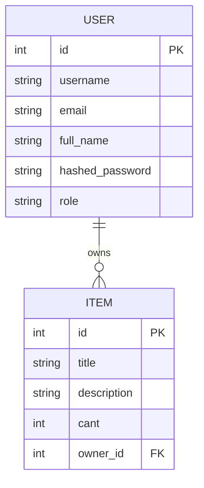

# FastAPI Technical Challenge

REST API desarrollada con FastAPI que implementa autenticación JWT, roles de usuario, CRUD de usuarios e items, frontend básico con HTML/CSS/JS y soporte para Docker.

---

## Tecnologías

- **FastAPI** — framework web
- **SQLModel** — ORM + validación
- **SQLite** — base de datos
- **Alembic** — migraciones
- **JWT** — autenticación
- **Docker / Docker Compose** — contenedores
- **Pytest** — tests

---

## Cómo levantar el proyecto

### Con Docker (recomendado)

Requisitos: tener Docker y Docker Compose instalados.

```bash
# 1. Clonar el repositorio
git clone https://github.com/Mat-Indaco/fast-API.git
cd fast-API

# 2. Crear el archivo de base de datos vacío (necesario para el volumen de Docker)
touch database.db

# 3. Levantar el proyecto
docker compose up --build
```

Al iniciar, Docker automáticamente:
- corre las migraciones de Alembic
- crea los usuarios de prueba predefinidos
- levanta el servidor en el puerto 8000

La API queda disponible en: `http://localhost:8000`

---

### Localmente (sin Docker)

Requisitos: Python 3.13 y `uv` instalados.

```bash
# 1. Instalar dependencias
uv sync

# 2. Correr migraciones
uv run alembic upgrade head

# 3. Crear usuarios de prueba
uv run python seed.py

# 4. Levantar el servidor
uv run uvicorn main:app --reload
```

La API queda disponible en: `http://localhost:8000`

---

## Cómo ejecutar los tests

```bash
# Con uv
uv run pytest

# Con pytest directamente (si está en el PATH)
pytest
```

Para ver más detalle en la salida:

```bash
uv run pytest -v
```

---

## Usuarios de prueba predefinidos

Al levantar el proyecto con Docker (o correr `seed.py` localmente), se crean automáticamente estos usuarios:

| Username | Password | Rol   |
|----------|----------|-------|
| `admin`  | `admin`  | Admin |
| `user`   | `user`   | User  |
| `user2`  | `user2`  | User  |

---

## Cómo loguearse

### Opción 1 — Frontend web

1. Abrí `http://localhost:8000`
2. Ingresá username y password
3. Al autenticarte correctamente, serás redirigido al dashboard en `/home`

---

### Opción 2 — Swagger UI

1. Abrí `http://localhost:8000/docs`
2. Buscá el endpoint `POST /login`
3. Hacé click en **Try it out**
4. Completá el formulario:

```
username: admin
password: admin
```

5. Ejecutá y copiá el `access_token` de la respuesta
6. Hacé click en el botón **Authorize** (arriba a la derecha)
7. Pegá el token con el formato: `Bearer <token>`

---

### Opción 3 — curl

```bash
curl -X POST http://localhost:8000/login \
  -H "Content-Type: application/x-www-form-urlencoded" \
  -d "username=admin&password=admin"
```

Respuesta esperada:

```json
{
  "access_token": "eyJhbGciOiJIUzI1NiIsInR5cCI6IkpXVCJ9...",
  "token_type": "bearer"
}
```

Para usar el token en requests posteriores:

```bash
# Ejemplo: listar usuarios
curl http://localhost:8000/users/ \
  -H "Authorization: Bearer <access_token>"

# Ejemplo: crear un item
curl -X POST http://localhost:8000/items/ \
  -H "Authorization: Bearer <access_token>" \
  -H "Content-Type: application/json" \
  -d '{"title": "Notebook", "cant": 2, "description": "Lenovo ThinkPad"}'
```

---

## Endpoints principales

### Auth

| Método | Endpoint | Descripción | Auth requerida |
|--------|----------|-------------|----------------|
| POST | `/login` | Login, devuelve JWT | No |

### Usuarios

| Método | Endpoint | Descripción | Auth requerida |
|--------|----------|-------------|----------------|
| POST | `/users/` | Crear usuario | No |
| GET | `/users/` | Listar usuarios | Sí |
| GET | `/users/{id}` | Obtener usuario | Sí |
| PATCH | `/users/{id}` | Actualizar usuario | Sí |
| DELETE | `/users/{id}` | Eliminar usuario | Solo Admin |

### Items

| Método | Endpoint | Descripción | Auth requerida |
|--------|----------|-------------|----------------|
| POST | `/items/` | Crear item | Sí |
| GET | `/items/` | Listar items propios | Sí |
| DELETE | `/items/{id}` | Eliminar item propio | Sí |

---

## Roles

**USER** puede: ver usuarios, crear items, eliminar sus propios items.

**ADMIN** puede todo lo anterior más: eliminar cualquier usuario (excepto a sí mismo).

---

## Estructura del proyecto

```
fast-API/
│
├── alembic/               # Migraciones de base de datos
├── routers/
│   ├── auth.py            # Endpoint de login
│   ├── users.py           # CRUD de usuarios
│   └── items.py           # CRUD de items
├── static/                # CSS
├── templates/             # HTML (login, home, register)
├── test/                  # Tests con Pytest
│
├── main.py                # App principal, rutas de frontend
├── models.py              # Modelos SQLModel (User, Item)
├── schemas.py             # Schemas de entrada/salida
├── security.py            # JWT, hashing, dependencias de auth
├── services.py            # Lógica de negocio
├── db.py                  # Configuración de base de datos
├── seed.py                # Script de usuarios de prueba
├── entrypoint.sh          # Script de inicio para Docker
│
├── Dockerfile
├── docker-compose.yml
└── pyproject.toml
```

---


# Database Diagram



---


## Descripción personal del proyecto

Arranqué definiendo los modelos de datos: dos entidades, `User` e `Item`, con una relación de uno a muchos. Cada usuario puede tener muchos items, y cada item pertenece a un único usuario.

Para la autenticación implementé JWT: al hacer login se genera un token firmado con una clave secreta, y ese token se valida en cada request protegido mediante una dependencia de FastAPI. Agregué un sistema de roles (USER / ADMIN) para la lógica de negocio: solo el admin puede eliminar usuarios, y cada usuario solo puede ver y eliminar sus propios items.

La DB es SQLite gestionada con SQLModel  y Alembic para migraciones. Elegí SQLite porque esta integrada con python y SQLModel porque es del mismos creador que fastapi,como es en un solo archiva facilita levantarlo localmente o con Docker.

El frontend es minimalista — tres páginas HTML con CSS y algo de JS para manejar el login, el registro y el dashboard.

Para Docker armé un `Dockerfile` con `uv` como gestor de dependencias y un `entrypoint.sh` que corre las migraciones y el seed automáticamente antes de levantar el servidor, para que el proyecto funcione con un solo `docker compose up`.

Los tests cubren los flujos principales de usuarios e items con un cliente de test de FastAPI y una base de datos SQLite en memoria para no tocar la de desarrollo.

## Autor

Matías Indaco

