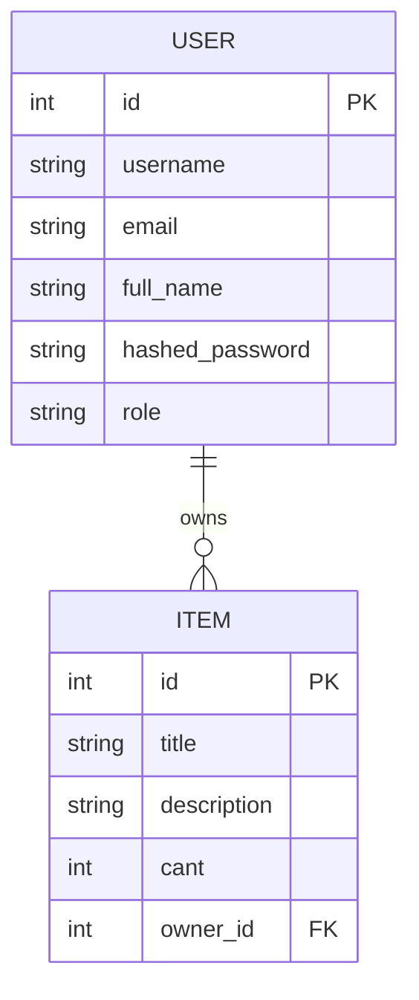

## Database Diagram

Estructura del proyecto
Fast-API_test/
│
├── alembic/
├── routers/
│   ├── auth.py
│   ├── users.py
│   └── items.py
│
├── static/
├── templates/
├── test/
│
├── main.py
├── models.py
├── schemas.py
├── security.py
├── services.py
├── db.py
│
├── Dockerfile
├── docker-compose.yml
├── pyproject.toml
└── README.md
Cómo ejecutar el proyecto
1. Clonar repositorio
git clone https://github.com/Mat-Indaco/fast-API.git
cd fast-API
Ejecutar localmente
Instalar dependencias

Con uv:

uv sync

o con pip:

pip install -r requirements.txt
Ejecutar aplicación
uvicorn main:app --reload
Swagger Docs

Disponible en:

http://127.0.0.1:8000/docs
Frontend

Login:

http://127.0.0.1:8000/

Home:

http://127.0.0.1:8000/home
Docker
Build
docker build -t fastapi-app .
Run
docker run -p 8000:8000 fastapi-app
Docker Compose
docker compose up --build
Tests

Ejecutar tests:

pytest
Endpoints principales
Auth
Método	Endpoint	Descripción
POST	/login	Login JWT
Users
Método	Endpoint	Descripción
POST	/users/	Crear usuario
GET	/users/	Listar usuarios
GET	/users/{id}	Obtener usuario
PATCH	/users/{id}	Actualizar usuario
DELETE	/users/{id}	Eliminar usuario
Items
Método	Endpoint	Descripción
POST	/items/	Crear item
GET	/items/	Listar items
DELETE	/items/{id}	Eliminar item
Lógica de negocio implementada
Roles de usuario
Protección de endpoints
Validación JWT
Ownership de items
Prevención de autodelete de admins
Validación de usuarios duplicados
Suma automática de cantidad de items repetidos
Autor

Matías Indac